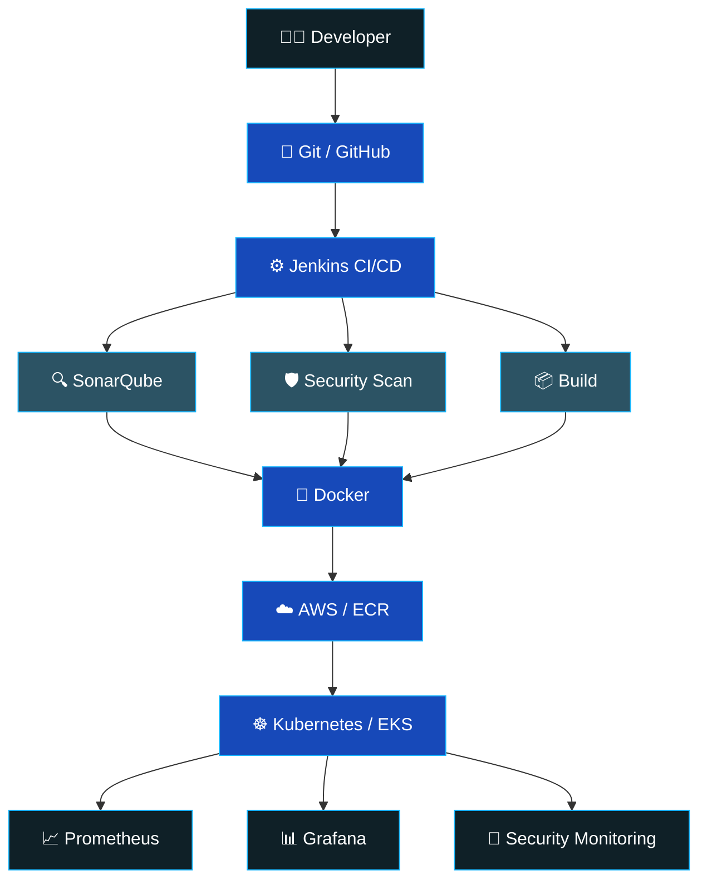

<div align="center">


<br/>

<a href="https://git.io/typing-svg">
  
</a>

<br/><br/>

<a href="https://github.com/arunpranav0803"></a>
<a href="https://www.linkedin.com/in/arunpranav-ks-b706b0245"></a>
<a href="mailto:arunpranav0803@gmail.com"></a>


</div>


## 👨‍💻 About Me

I'm **Arunpranav KS**, a DevSecOps Engineer focused on building secure, scalable and automated cloud infrastructure — currently at **Cytrusst Intelligence**, a cybersecurity company delivering AI-driven GRC, ASM, CSPM and DPDP compliance products.

```yaml
role: DevSecOps Engineer
company: Cytrusst Intelligence
location: Bengaluru, India
focus:
  - AWS Cloud Infrastructure & Security
  - CI/CD Automation (Jenkins, GitOps)
  - Kubernetes & Amazon EKS
  - Security Monitoring & Threat Detection
  - Infrastructure as Code
currently_learning: Advanced Kubernetes Security Patterns
fun_fact: I automate everything possible ⚙️
```


## 🧰 Tech Arsenal

<div align="center">

### ☁️ Cloud & AWS
 &nbsp;


### 🚀 DevOps & CI/CD


### ☸️ Containers & Orchestration


### 🔐 Security & DevSecOps


### 📊 Monitoring & Observability


### ☕ Programming & Backend


</div>


## 🔥 DevSecOps Pipeline




## 💼 Professional Experience

<table>
<tr>
<td width="50%" valign="top">

### 🛡️ DevSecOps Engineer
**Cytrusst Intelligence** · 2025 – Present · Bengaluru

- Developed & maintained Jenkins CI/CD pipelines
- Automated application delivery to Amazon EKS
- Remediated CSPM issues (IAM, security groups, logging)
- Managed internal IT ops & access control
- Provisioned & maintained infrastructure
- Deployed containerized AI apps & WebSocket servers via Docker
- Built Grafana dashboards & Prometheus monitoring
- Configured Blackbox Exporter & Alertmanager alerts

</td>
<td width="50%" valign="top">

### 🔎 Security Analyst Intern
**Cytrusst Intelligence** · 2024 – 2025 · Bengaluru

- Monitored security alerts via Wazuh SIEM
- Worked with SentinelOne EDR
- Performed vulnerability assessments
- Supported patch management
- Configured NGINX reverse proxy & SSL/TLS
- Managed endpoints via ManageEngine
- Implemented browser & Linux hardening
- Authored security operation SOPs

</td>
</tr>
</table>


## 🚀 Featured Projects

<table>
<tr>
<td width="50%" valign="top">
<h3>📡 Real-Time API Monitoring</h3>

<p><code>Prometheus</code> <code>Grafana</code> <code>Blackbox Exporter</code> <code>Alertmanager</code> <code>Linux</code></p>

Scalable API monitoring solution for public & private endpoints, built to support monitoring of thousands of APIs.

- Blackbox Exporter endpoint probing
- Alertmanager email notifications
- Grafana dashboards
- Response-time & uptime tracking

</td>
<td width="50%" valign="top">
<h3>⚙️ Automated Web App Deployment</h3>

<p><code>AWS</code> <code>Linux</code> <code>GitHub</code> <code>Maven</code> <code>Ansible</code> <code>Tomcat</code></p>

Automated deployment pipeline for a web application to an AWS-hosted Linux server.

- Infrastructure configuration via Ansible
- Maven build automation
- WAR deployment to Apache Tomcat
- End-to-end AWS Linux workflow

</td>
</tr>
<tr>
<td width="50%" valign="top">
<h3>🔄 CI/CD Web App Deployment</h3>

<p><code>AWS</code> <code>Jenkins</code> <code>Maven</code> <code>Tomcat</code></p>

End-to-end CI/CD pipeline to automatically build & deploy a portfolio web application.

`GitHub → Jenkins → Maven Build → WAR → Tomcat → AWS`

- Jenkins pipeline automation
- Automated WAR builds & deployment

</td>
<td width="50%" valign="top">
<h3>🤖 Employee Attrition Prediction</h3>

<p><code>Machine Learning</code> <code>Logistic Regression</code> <code>Random Forest</code></p>

Predictive ML model to forecast employee attrition from HR datasets.

- HR data analysis & feature engineering
- Logistic Regression + Random Forest models
- Early attrition risk detection

</td>
</tr>
</table>


## 🛡️ Security Stack

<div align="center">

| Layer | Tooling |
|:--|:--|
| **SIEM** | Wazuh |
| **EDR** | SentinelOne |
| **Endpoint Management** | ManageEngine |
| **Cloud Security** | AWS IAM / CSPM |
| **Network Security** | NGINX / SSL / TLS |
| **Monitoring** | CloudWatch / Wazuh |
| **Incident Response** | RCA / Jira |
| **Hardening** | Browser / Linux |

</div>


## 📈 GitHub Analytics

> Live stats via **GitHub Stats Extended** — the actively maintained successor to github-readme-stats. The original project's public Vercel instance keeps hitting GitHub's API rate limits and returning broken images; this fork is the maintainers' own recommended fix.

<div align="center">


<br/>


<br/>

### 🧊 3D Contribution Calendar


</div>

> **If any widget above shows broken/error:** these are all free, best-effort, third-party Vercel-hosted services — the breakage is on their end (rate limits / outages), not in the README markup. The permanent fix is the self-hosting workflow below, which renders these as static SVGs on a schedule via GitHub's own infrastructure, so your profile never depends on a live third-party server responding at page-load time.

<details>
<summary><b>🔧 Self-hosted reliability fix (recommended) — click to expand</b></summary>

<br/>

Create `.github/workflows/profile-stats.yml` in your `arunpranav0803/arunpranav0803` repo:

```yaml
name: Generate Snake & Contribution Graphs

on:
  schedule:
    - cron: "0 0 * * *"
  workflow_dispatch:
  push:
    branches: [ main ]

jobs:
  generate:
    runs-on: ubuntu-latest
    steps:
      - name: Generate Snake Animation
        uses: Platane/snk@v3
        with:
          github_user_name: arunpranav0803
          outputs: |
            dist/github-contribution-grid-snake.svg
            dist/github-contribution-grid-snake-dark.svg?palette=github-dark

      - name: Push to output branch
        uses: crazy-max/ghaction-github-pages@v4
        with:
          target_branch: output
          build_dir: dist
        env:
          GITHUB_TOKEN: ${{ secrets.GITHUB_TOKEN }}
```

Then embed it with:
```md

```

This renders once a day via GitHub's own infrastructure and commits the result to an `output` branch — no dependency on a public Vercel instance staying up.

</details>


## 🎯 Current Focus

<div align="center">

| Skill | Progress |
|:--|:--|
| Cloud Security |  |
| DevSecOps |  |
| AWS |  |
| Kubernetes |  |
| CI/CD Automation |  |
| Observability |  |

</div>


## 🎓 Education

<div align="center">

**B.E. Computer Science & Engineering**
Bannari Amman Institute of Technology · 2020 – 2024 · CGPA 7.6

</div>


## 🤝 Let's Connect

<div align="center">

<a href="https://github.com/arunpranav0803"></a>
<a href="https://www.linkedin.com/in/arunpranav-ks-b706b0245"></a>
<a href="mailto:arunpranav0803@gmail.com"></a>

<br/><br/>

**Building secure infrastructure. Automating everything possible.**
*Automate • Secure • Observe • Scale*

</div>


